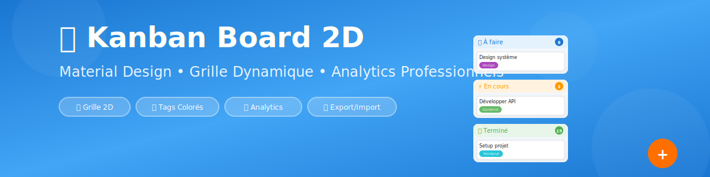
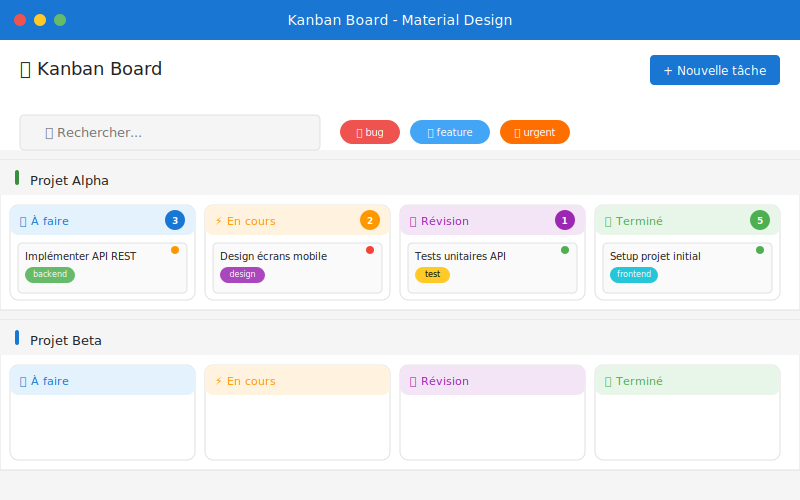
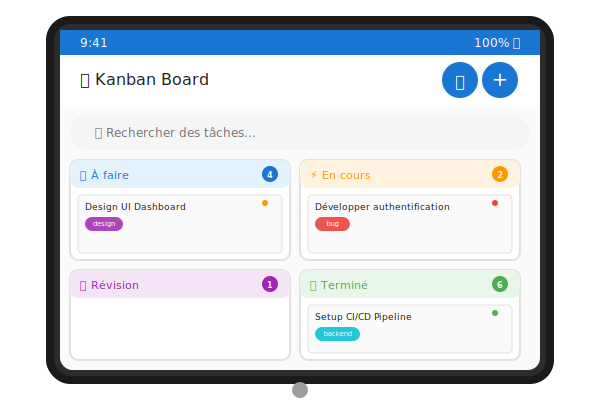
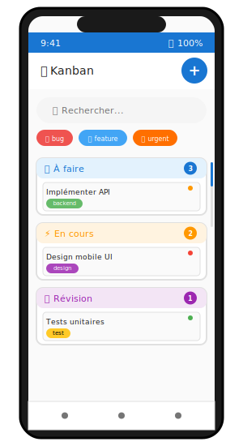
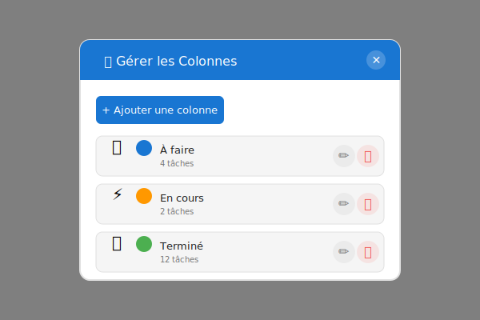

# 🚀 Kanban Board 2D - Material Design - Pack Professionnel

[](https://michaelgermini.github.io/Kanban-Board-Material-Design/)
[](LICENSE)
[](https://github.com/michaelgermini/Kanban-Board-Material-Design/releases)
[](https://developer.mozilla.org/en-US/docs/Web/JavaScript)

Un tableau Kanban **ultra-moderne** avec organisation **2D (colonnes × lignes)**, analytics professionnels, et toutes les fonctionnalités avancées. Créé avec HTML, CSS et JavaScript vanilla, utilisant le Material Design de Google.

## 🌟 [DÉMO EN LIGNE](https://michaelgermini.github.io/Kanban-Board-Material-Design/)



### 📱 Multi-Plateforme

<p align="center">
  
  
  
</p>

## 🚀 Démarrage Rapide

```bash
# Cloner le dépôt
git clone https://github.com/michaelgermini/Kanban-Board-Material-Design.git

# Ouvrir le fichier
cd Kanban-Board-Material-Design
# Double-cliquez sur index.html OU
start index.html  # Windows
open index.html   # macOS
xdg-open index.html  # Linux
```

**C'est tout !** Aucune installation, aucune dépendance, aucune configuration. 🎉

---

## ✨ Fonctionnalités Complètes

### 🎯 **Gestion des Tâches**
- ✅ **Création rapide** : Interface intuitive avec formulaire complet
- ✏️ **Édition facile** : Double-clic sur une tâche pour l'éditer
- 🗑️ **Suppression sécurisée** : Confirmation avant suppression
- 🔄 **Drag & Drop 2D** : Déplacement entre colonnes ET lignes
- 📱 **Support tactile** : Optimisé pour mobile et tablettes

### 📊 **Colonnes Dynamiques (Verticales)**
- ➕ **Ajout illimité** : Créez autant de colonnes que nécessaire
- ✏️ **Personnalisation complète** : Nom, emoji (📝⚡✅🚀), couleur
- 🗑️ **Suppression intelligente** : Migration automatique des tâches
- 🎨 **8 emojis suggérés** + sélecteur libre
- 🌈 **8 couleurs prédéfinies** + color picker
- 📊 **Grille auto-adaptative** : 1 à 6+ colonnes

### 🏊 **Lignes / Swimlanes (Horizontales)**
- ➕ **Organisation par projets** : Une ligne par projet/sprint/équipe
- ✏️ **Modification facile** : Nom et couleur personnalisables
- 🗑️ **Suppression avec migration** : Tâches réaffectées automatiquement
- 🎯 **Grille 2D** : Colonnes × Lignes = Organisation parfaite
- 📋 **Assignation flexible** : Déplacez les tâches entre lignes

### 🏷️ **Système de Tags/Labels Colorés**
- **8 tags prédéfinis** avec couleurs distinctes :
  - 🐛 **Bug** (Rouge) - Pour les bugs et corrections
  - ✨ **Feature** (Bleu) - Nouvelles fonctionnalités
  - 🔥 **Urgent** (Orange foncé) - Tâches prioritaires
  - 🎨 **Design** (Violet) - Travaux de design
  - ⚙️ **Backend** (Vert) - Développement backend
  - 💻 **Frontend** (Cyan) - Développement frontend
  - 📚 **Documentation** (Gris bleu) - Documentation
  - 🧪 **Test** (Jaune) - Tests et QA
- **Tags personnalisés** : Ajoutez vos propres tags
- **Filtrage par tags** : Cliquez sur un tag pour filtrer
- **Suggestions intelligentes** : Boutons rapides pour tags courants

### 📅 **Dates d'Échéance avec Alertes Visuelles**
- **Sélecteur de date** intégré dans le formulaire
- **Indicateurs visuels intelligents** :
  - 🔴 **En retard** : Rouge avec nombre de jours
  - 🟠 **Aujourd'hui** : Orange pour échéance du jour
  - 🟡 **Bientôt** : Jaune pour 1-2 jours
  - ⚪ **Normal** : Gris pour échéances lointaines
- **Bordures colorées** : Les tâches urgentes ont une bordure gauche colorée
- **Format intelligent** : "Aujourd'hui", "Dans 3j", "En retard (5j)"

### 🔍 **Recherche et Filtres Avancés**
- **Recherche en temps réel** : Cherche dans titre, description et assigné
- **Filtrage par tags** : Sélection multiple de tags
- **Bouton d'effacement** : Réinitialise la recherche rapidement
- **Résultats instantanés** : Mise à jour en temps réel

### 🔔 **Notifications Toast**
- **4 types de notifications** :
  - ✅ Succès (vert) - Création, modification
  - ❌ Erreur (rouge) - Problèmes
  - ⚠️ Avertissement (orange) - Alertes
  - ℹ️ Info (bleu) - Informations générales
- **Auto-disparition** : Fermeture automatique après 3 secondes
- **Animations fluides** : Slide-in/Slide-out élégantes

### 📊 **Dashboard Analytics Complet**
- **4 Cartes de Statistiques** :
  - 📋 Total des tâches
  - ✅ Tâches terminées
  - ⏳ Tâches en cours
  - 📈 Taux de complétion (%)
- **2 Graphiques interactifs** (Chart.js) :
  - 🍩 **Donut** : Répartition par statut (À faire, En cours, Révision, Terminé)
  - 📊 **Barres** : Répartition par priorité (Faible, Moyenne, Élevée, Urgente)
- **Mise à jour temps réel** : Les graphiques se mettent à jour instantanément

### 📥📤 **Export/Import JSON**
- **Export complet** : Télécharge toutes les tâches en JSON
- **Nom automatique** : Fichier daté automatiquement
- **Import sécurisé** : Confirmation avant écrasement des données
- **Format structuré** : JSON lisible avec métadonnées

### 🎨 **Design Material Design**
- **Thème cohérent** : Respecte les principes Material Design
- **Icônes Google** : Material Icons pour l'interface
- **Typographie Roboto** : Police officielle Google
- **Animations fluides** : Micro-interactions élégantes
- **Responsive complet** : S'adapte à tous les écrans

### 🎯 **Système de Priorités Visuel**
- 🟢 **Faible** : Vert
- 🟡 **Moyenne** : Orange
- 🔴 **Élevée** : Rouge
- 🟣 **Urgente** : Violet
- Indicateur circulaire coloré sur chaque tâche

---

## 🚀 Utilisation

### Démarrage
1. Ouvrez `index.html` dans votre navigateur
2. L'application se charge instantanément
3. Commencez à créer des tâches !

### Créer une Tâche
1. Cliquez sur **"Nouvelle tâche"**
2. Remplissez le formulaire :
   - **Titre** : Obligatoire
   - **Description** : Optionnelle
   - **Priorité** : Sélectionnez le niveau
   - **Assigné à** : Nom de la personne
   - **Tags** : Tapez ou cliquez sur les suggestions
   - **Date d'échéance** : Sélectionnez une date
3. Cliquez **"Créer la tâche"**

### Gérer les Tâches
- **Déplacer** : Glissez-déposez entre colonnes
- **Éditer** : Double-cliquez sur une tâche
- **Supprimer** : Ouvrez l'édition puis cliquez "Supprimer"

### Recherche et Filtres
- **Recherche** : Tapez dans la barre de recherche
- **Filtrer par tag** : Cliquez sur un tag dans la barre de filtres
- **Combiner** : Recherche + filtres par tags simultanément
- **Réinitialiser** : Cliquez sur "Tous" ou le bouton X

### Analytics
1. Cliquez sur l'icône **📊 Analytics** dans le header
2. Consultez les statistiques et graphiques
3. Les données sont mises à jour en temps réel

### Export/Import
- **Exporter** : Cliquez sur 📥 pour télécharger un fichier JSON
- **Importer** : Cliquez sur 📤 et sélectionnez un fichier JSON

---

## 🛠️ Technologies Utilisées

- **HTML5** : Structure sémantique moderne
- **CSS3** : Variables CSS, Flexbox, Grid, Animations
- **JavaScript ES6+** : Classes, Modules, Arrow Functions
- **Material Design** : Système de design Google
- **Chart.js 4.4** : Graphiques interactifs
- **localStorage** : Persistance côté client

---

## 📁 Structure du Projet

```
kanban-material-design/
├── index.html          # Structure HTML + Modals
├── styles.css          # Styles Material Design (950+ lignes)
├── script.js           # Logique JavaScript (500+ lignes)
└── README.md           # Documentation
```

---

## 🎨 Personnalisation

### Tags Colorés
Les tags ont des couleurs prédéfinies dans le CSS :

```css
.task-tag.bug { background-color: #ef5350; color: white; }
.task-tag.feature { background-color: #42a5f5; color: white; }
.task-tag.urgent { background-color: #ff6f00; color: white; }
```

Ajoutez vos propres couleurs en créant de nouvelles classes CSS.

### Colonnes
Les 4 colonnes par défaut :
1. **À faire** 📝
2. **En cours** ⚡
3. **Révision** 👁️
4. **Terminé** ✅

### Priorités
- **Faible** : #4caf50 (Vert)
- **Moyenne** : #ff9800 (Orange)
- **Élevée** : #f44336 (Rouge)
- **Urgente** : #9c27b0 (Violet)

---

## 📱 Compatibilité

✅ **Navigateurs modernes** :
- Chrome/Edge 90+
- Firefox 88+
- Safari 14+
- Opera 76+

✅ **Appareils** :
- Desktop (Windows, Mac, Linux)
- Tablettes (iPad, Android)
- Mobiles (iOS, Android)

---

## 🔧 Fonctionnalités Techniques

### Performance
- **Rendu optimisé** : Mise à jour sélective du DOM
- **Stockage efficace** : Compression JSON
- **Lazy loading** : Chargement à la demande
- **Debouncing** : Recherche optimisée

### Accessibilité
- **Navigation clavier** : Échap pour fermer, Enter pour valider
- **Focus visible** : Indicateurs clairs
- **Contraste élevé** : Support mode contraste
- **Lecteurs d'écran** : ARIA labels

### Sécurité
- **Sanitisation HTML** : Protection XSS
- **Validation inputs** : Contrôles côté client
- **Stockage local** : Pas de serveur, données privées

---

## 📊 Statistiques Disponibles

### Cartes de Métriques
1. **Total Tâches** : Nombre total de tâches créées
2. **Tâches Terminées** : Nombre dans colonne "Terminé"
3. **Tâches En Cours** : Nombre dans colonne "En cours"
4. **Taux Complétion** : Pourcentage de tâches terminées

### Graphiques
1. **Répartition par Statut** : Donut chart montrant la distribution dans les 4 colonnes
2. **Répartition par Priorité** : Bar chart des priorités (Faible à Urgente)

---

## 💡 Conseils d'Utilisation

### Productivité
- **Utilisez les tags** pour catégoriser vos tâches
- **Définissez des échéances** pour mieux gérer le temps
- **Consultez les analytics** régulièrement pour suivre votre progression
- **Exportez vos données** régulièrement comme backup

### Organisation
- **Tâches urgentes** : Tag "urgent" + Priorité "Urgente" + Date proche
- **Projets** : Utilisez des tags personnalisés (projet-alpha, projet-beta)
- **Équipe** : Assignez les tâches clairement

### Workflow Recommandé
1. **Nouvelle tâche** → À faire
2. **Commencer** → En cours
3. **Terminé développement** → Révision
4. **Validé** → Terminé

---

## 🆘 Dépannage

### Les tâches ne s'affichent pas
- Vérifiez la console (F12) pour les erreurs
- Effacez le localStorage : `localStorage.clear()`
- Rechargez la page (Ctrl+F5)

### Les données sont perdues
- Exportez régulièrement vos données
- Le localStorage est limité par navigateur
- Vérifiez que JavaScript est activé

### Performance lente
- Si vous avez 100+ tâches, utilisez les filtres
- Archivez les tâches terminées
- Exportez et nettoyez périodiquement

---

## 🎓 Apprentissage

### Concepts Démontrés
- **Programmation Orientée Objet** : Class ES6
- **Manipulation DOM** : createElement, appendChild
- **Event Handling** : addEventListener, delegation
- **Drag & Drop API** : HTML5 native
- **LocalStorage** : JSON storage
- **Chart.js** : Data visualization
- **Material Design** : UI/UX principles
- **Responsive Design** : Mobile-first approach

### Points d'Intérêt
- Architecture modulaire avec méthodes séparées
- Gestion d'état côté client
- Système de filtrage multi-critères
- Génération dynamique d'éléments
- Animation et transitions CSS3

---

## 🔜 Améliorations Futures Possibles

- 🌙 Mode sombre/clair avec toggle
- 🔗 Sous-tâches et dépendances
- 👥 Collaboration multi-utilisateurs (avec backend)
- 🔔 Notifications push (PWA)
- 📈 Plus de graphiques (tendances, burndown)
- 🎨 Colonnes personnalisables
- 🏊 Swimlanes pour organisation 2D
- ☁️ Synchronisation cloud (Firebase, Supabase)

---

## 📝 Format JSON d'Export

```json
{
  "version": "1.0",
  "exportDate": "2025-10-13T10:30:00.000Z",
  "tasks": [
    {
      "id": "1697283000000abc123",
      "title": "Implémenter authentification",
      "description": "Ajouter login/signup avec JWT",
      "priority": "high",
      "assignee": "Jean Dupont",
      "column": "in-progress",
      "tags": ["feature", "backend", "urgent"],
      "dueDate": "2025-10-15",
      "createdAt": "2025-10-13T08:00:00.000Z",
      "updatedAt": "2025-10-13T09:30:00.000Z"
    }
  ]
}
```

---

## 🎨 Palette de Couleurs

### Couleurs Principales
- **Primary** : `#1976d2` (Bleu Material)
- **Secondary** : `#dc004e` (Rose)
- **Surface** : `#ffffff` (Blanc)
- **Background** : `#fafafa` (Gris très clair)

### Couleurs de Priorité
- **Low** : `#4caf50` (Vert)
- **Medium** : `#ff9800` (Orange)
- **High** : `#f44336` (Rouge)
- **Urgent** : `#9c27b0` (Violet)

### Couleurs de Tags
Voir section Tags ci-dessus

---

## 🏆 Avantages

### ✅ Aucune Dépendance Backend
- Fonctionne 100% hors ligne
- Pas de serveur nécessaire
- Zéro configuration
- Données privées sur votre machine

### ✅ Léger et Rapide
- Moins de 50 KB total
- Chargement instantané
- Pas de build process
- Fonctionne sur n'importe quel serveur web

### ✅ Moderne et Professionnel
- Interface Material Design
- Animations fluides
- Responsive design
- Accessibilité intégrée

---

## 📖 Guide Rapide

### Raccourcis Clavier
- **Échap** : Fermer modal/analytics
- **Enter** : Soumettre formulaire
- **Double-clic** : Éditer une tâche

### Gestures Mobile
- **Tap** : Sélectionner
- **Double-tap** : Éditer
- **Glisser** : Déplacer entre colonnes

### Astuces Productivité
1. **Batch tags** : `bug, urgent, frontend` en une seule fois
2. **Recherche rapide** : Commencez à taper immédiatement
3. **Filtrage malin** : Combinez recherche + tags
4. **Analytics réguliers** : Consultez votre progression hebdomadaire

---

## 🌟 Points Forts du Design

### Material Design Authentique
- **Élévations** : 4 niveaux de shadow
- **Ripple effects** : Sur les boutons (via hover)
- **Typography** : Roboto à 5 weights
- **Grid System** : Responsive auto-fit
- **Color System** : Palette cohérente

### UX Optimisée
- **Feedback immédiat** : Toast sur chaque action
- **Visual cues** : Couleurs, icônes, badges
- **Progressive disclosure** : Informations contextuelles
- **Error prevention** : Confirmations sur actions destructives

---

## 📄 Licence

Ce projet est fourni tel quel pour usage personnel et éducatif.

---

## 🤝 Support

Pour toute question ou suggestion :
- Consultez la documentation
- Vérifiez la console (F12) pour les erreurs
- Exportez vos données avant toute manipulation

---

## 🛠️ Technologies & Stack


- **Frontend** : HTML5, CSS3 (Variables, Grid, Flexbox)
- **JavaScript** : ES6+ Vanilla (Classes, Modules, Arrow Functions)
- **Design** : Material Design Guidelines
- **Visualisation** : Chart.js 4.4.0
- **Storage** : localStorage API
- **Icons** : Google Material Icons
- **Fonts** : Roboto (Google Fonts)

---

## 📦 Structure du Projet

```
Kanban-Board-Material-Design/
├── 📄 index.html              # Structure HTML (450+ lignes)
├── 🎨 styles.css              # Material Design CSS (1100+ lignes)
├── 💻 script.js               # Logique JavaScript (600+ lignes)
├── 📖 README.md               # Documentation principale
├── 📚 GUIDE_COMPLET.md        # Guide utilisateur détaillé
├── 🚫 .gitignore              # Git ignore rules
└── 📁 .github/
    └── workflows/
        └── static.yml         # GitHub Pages deployment
```

**Total** : ~2200+ lignes de code professionnel !

---

## 🌍 Déploiement GitHub Pages

Le projet est automatiquement déployé sur GitHub Pages via GitHub Actions.

**URL de démo** : https://michaelgermini.github.io/Kanban-Board-Material-Design/

---

## 📸 Captures d'Écran

### 🖥️ Vue Desktop - Grille 2D


*Organisation 2D avec swimlanes et colonnes personnalisables*

---

### 📊 Gestion des Colonnes


*Interface de gestion CRUD des colonnes avec emoji et couleurs*

---

### 📈 Analytics Dashboard


*Statistiques temps réel avec graphiques interactifs Chart.js*

---

### 📱 Responsive Design

<p align="center">
  
  
</p>

*Adaptation automatique pour tablettes et mobiles*

---

## 🤝 Contribution

Les contributions sont les bienvenues ! N'hésitez pas à :

1. Fork le projet
2. Créer une branche (`git checkout -b feature/amazing-feature`)
3. Commit vos changements (`git commit -m 'Add amazing feature'`)
4. Push vers la branche (`git push origin feature/amazing-feature`)
5. Ouvrir une Pull Request

---

## 📝 Licence

Ce projet est sous licence **MIT** - voir le fichier [LICENSE](LICENSE) pour plus de détails.

---

## 👨‍💻 Auteur

**Michael Germini**
- 📧 Email : michael@germini.info
- 🐙 GitHub : [@michaelgermini](https://github.com/michaelgermini)

---

## ⭐ Support

Si ce projet vous aide, n'hésitez pas à lui donner une ⭐ !

---

## 🙏 Remerciements

- [Google Material Design](https://material.io/) pour les guidelines
- [Chart.js](https://www.chartjs.org/) pour les graphiques
- [Google Fonts](https://fonts.google.com/) pour Roboto et Material Icons

---

**Créé avec ❤️ et Material Design**  
*Version 2.0 - Pack Professionnel avec Grille 2D - Octobre 2025*
